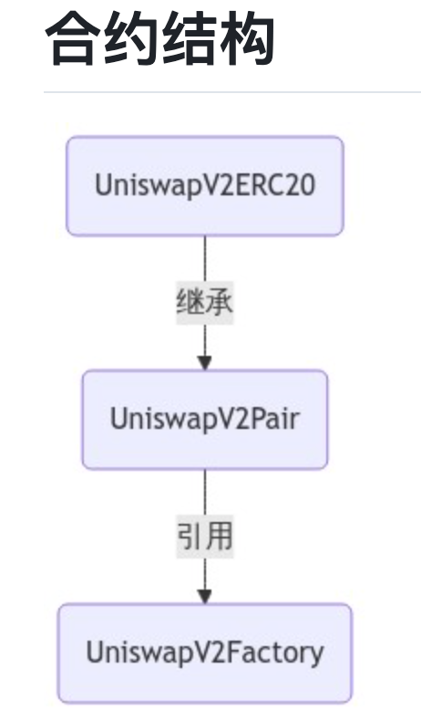
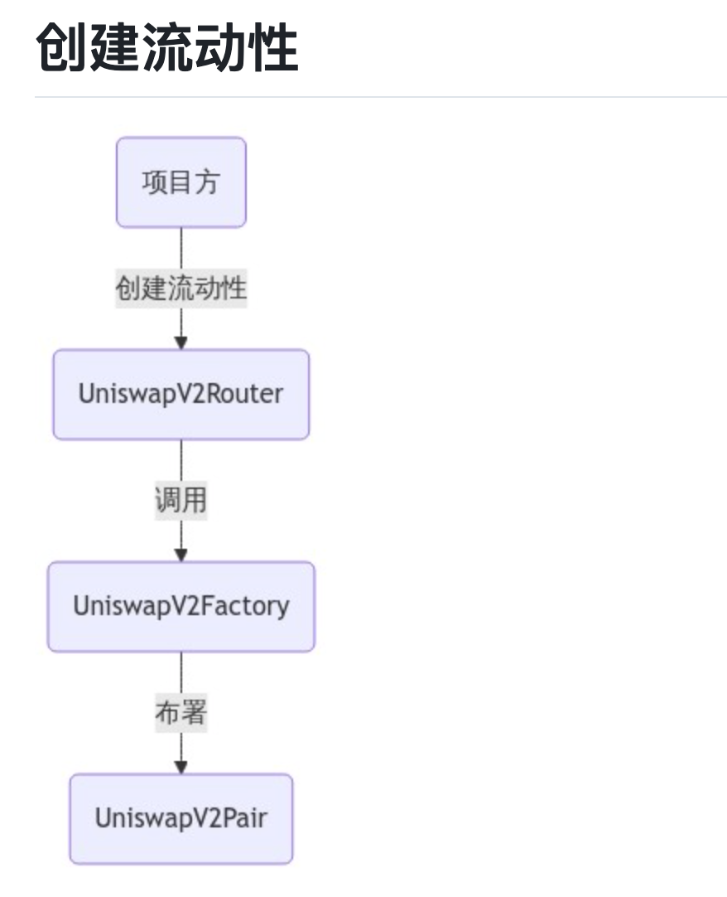
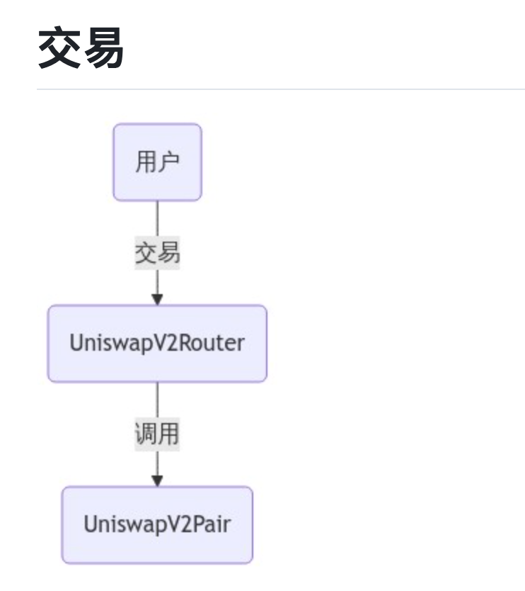
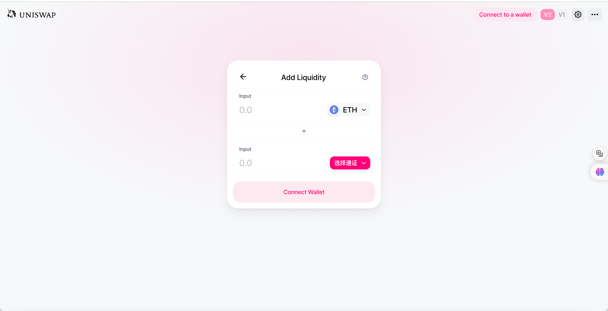
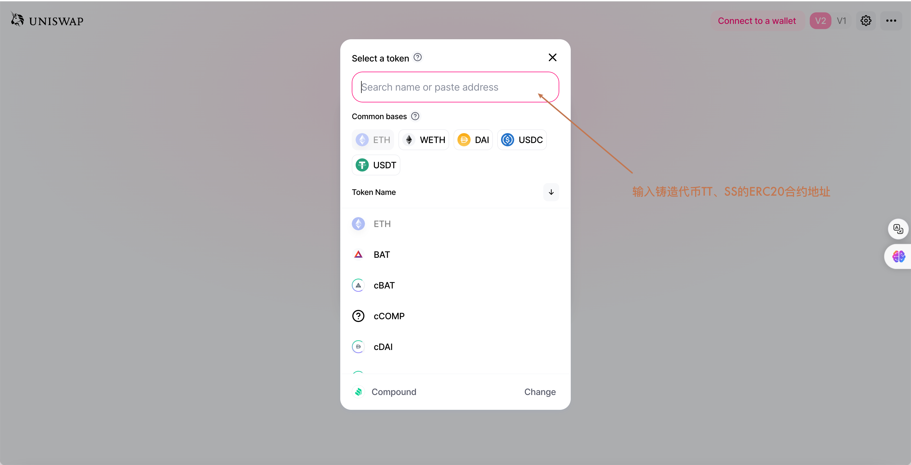
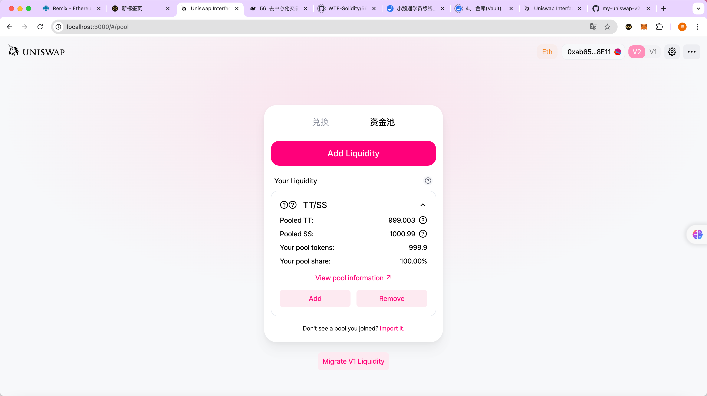
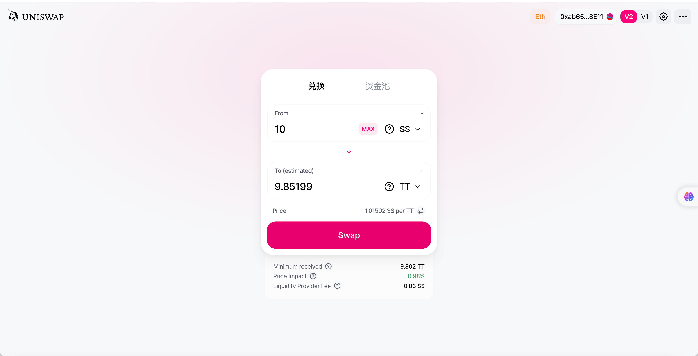
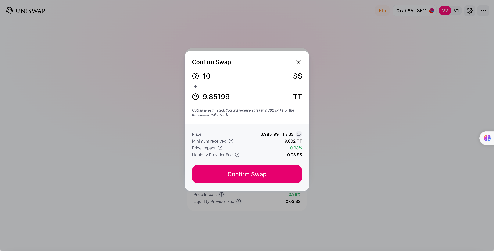
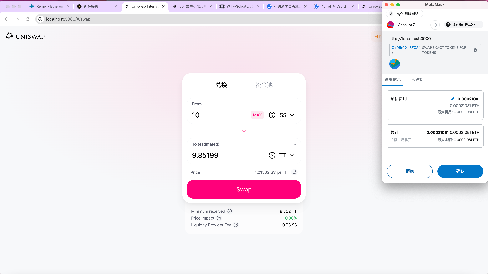
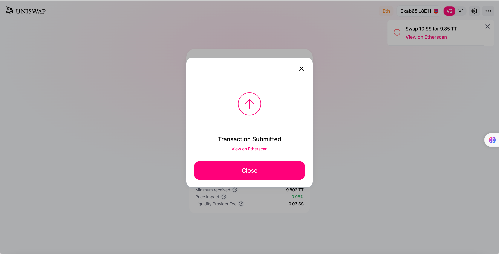

REMIX DEFAULT WORKSPACE

Remix default workspace is present when:
i. Remix loads for the very first time 
ii. A new workspace is created with 'Default' template
iii. There are no files existing in the File Explorer

This workspace contains 3 directories:

1. 'contracts': Holds three contracts with increasing levels of complexity.
2. 'scripts': Contains four typescript files to deploy a contract. It is explained below.
3. 'tests': Contains one Solidity test file for 'Ballot' contract & one JS test file for 'Storage' contract.

SCRIPTS

The 'scripts' folder has four typescript files which help to deploy the 'Storage' contract using 'web3.js' and 'ethers.js' libraries.

For the deployment of any other contract, just update the contract's name from 'Storage' to the desired contract and provide constructor arguments accordingly 
in the file `deploy_with_ethers.ts` or  `deploy_with_web3.ts`

In the 'tests' folder there is a script containing Mocha-Chai unit tests for 'Storage' contract.

To run a script, right click on file name in the file explorer and click 'Run'. Remember, Solidity file must already be compiled.
Output from script will appear in remix terminal.

Please note, require/import is supported in a limited manner for Remix supported modules.
For now, modules supported by Remix are ethers, web3, swarmgw, chai, multihashes, remix and hardhat only for hardhat.ethers object/plugin.
For unsupported modules, an error like this will be thrown: '<module_name> module require is not supported by Remix IDE' will be shown.

## 去中心交易所（恒和制造商Automated Market Maker，简称 AMM）
以uniswapV2为例实操，理解CPAMM（恒定乘积自动做市商Constant Product Automated Market Maker, CPAMM）的核心功能
要点：
主要有三大合约：工厂合约、配对合约、路由合约

创建流动性：

交易：

初始会有添加流动性的人往pair合约添加
uniswap的合约核心是工厂合约，pair合约是通过工厂合约进行部署的（不需要部署pair合约）
路由合约==》工厂合约/pair合约
工厂合约动态部署配对合约
先部署工厂合约再部署路由合约
实际操作步骤（结合智能合约）：
1、使用ERC20合约铸造两种代币：TT、SS，每种代币100000000，并记录代币合约的地址A、B

2、添加流动性，分别注入1000个TT、SS，此时兑换比例是1:1

参考 [text](https://github.com/Fankouzu/my-uniswap-v2-core/blob/master/Deploy.md)